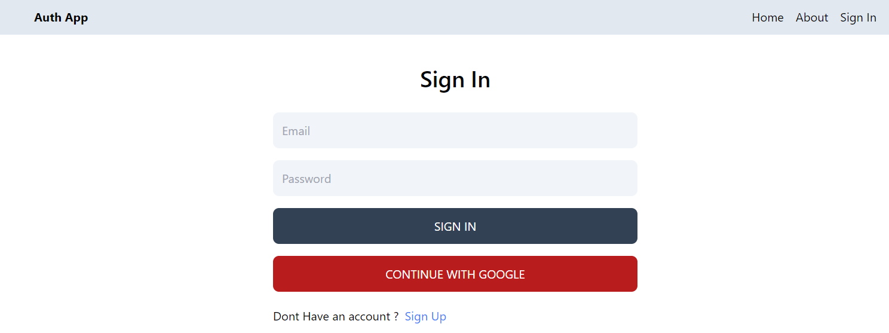

# MERN Authentication Website



## Overview

This project is a MERN stack application that includes authentication features, profile management, Google OAuth integration, and utilizes Redux for state management. It leverages MongoDB for database operations and Tailwind CSS for styling.

---

## Features

### Authentication

1. **Signup**: Allows new users to register with their email and password.
2. **Login**: Enables registered users to log in securely using their credentials.
3. **Logout**: Provides a mechanism to log out users and invalidate their sessions.

### Profile Management

1. **Edit Profile**: Users can update their usernames, emails, and passwords securely.
2. **Profile Picture**: Includes functionality to upload and update profile pictures using Firebase Storage.

### Google Authentication

1. **Google OAuth**: Integration with Google OAuth for seamless sign-in and authentication.

### State Management

1. **Redux Toolkit**: Efficient state management across components for user authentication and profile data.

### Database Operations

1. **MongoDB**: Utilizes MongoDB for CRUD operations to store user data securely.

---

## Technologies Used

- **Frontend**: React.js, Tailwind CSS
- **Backend**: Node.js, Express.js
- **Database**: MongoDB
- **State Management**: Redux Toolkit
- **Authentication**: JSON Web Tokens (JWT), Google OAuth
- **Storage**: Firebase Storage (for profile pictures)

---

## Installation

1. **Clone the repository:**

   ```bash
   git clone https://github.com/iamsufiyan560/Mern-Auth.git
   cd your-project-directory
   ```

2. **Install dependencies:**

   ```bash
   npm install
   ```

3. **Set up environment variables:**

   Create a `.env` file in the root directory with the following variables:

   ```plaintext
   PORT=5000  // Example port number
   MONGODB_URI=mongodb://localhost:27017/your-database-name
   JWT_SECRET=your-secret-key
   GOOGLE_CLIENT_ID=your-google-client-id
   GOOGLE_CLIENT_SECRET=your-google-client-secret
   ```

4. **Start the development server:**

   ```bash
   npm run dev
   ```

5. **Open your browser and navigate to** `http://localhost:3000` **to view the application.**

---

## Usage

1. **Signup**: Navigate to the signup page and register with your email and password.
2. **Login**: After signup, you can log in using your credentials.
3. **Profile Management**: Update your profile information and upload a profile picture.

4. **Google Authentication**: Optionally, use Google OAuth for quick sign-ins.

5. **Logout**: Click on the logout button to end your session securely.

---

## Contributing

Contributions are welcome! Please fork the repository and submit a pull request with your changes.

---

## License

This project is licensed under the MIT License - see the LICENSE file for details.

---

For detailed documentation and additional features, refer to the project's codebase and documentation.
